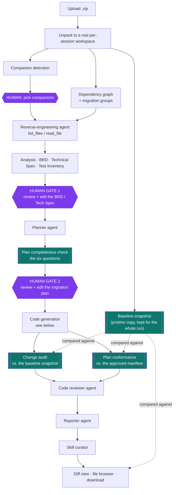
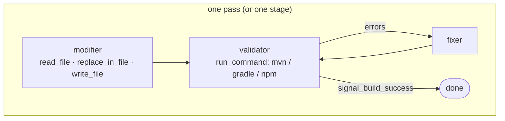

# Stella Modernizer

An AI-powered application modernization platform for migrating legacy codebases to modern architectures. Each migration runs as an agentic pipeline over a **real copy of your repository on disk** — agents list, read and rewrite actual files, then run the actual build — with a human review gate before anything is planned and again before anything is changed.

The platform is built on **Google ADK** with **Gemini**, and its domain knowledge lives in editable skill files rather than in Python.

---

## Supported Migration Patterns

| Pattern | From | To | Validation | Strategies |
|---|---|---|---|---|
| **Java 8 → Java 25** | Java 8, Spring 3/4, WAR | Java 25, Spring Boot 4.x, executable JAR | Real `mvn`/`gradle` compile + package | Bigbang **or** phased incremental |
| **Solr 4x → Solr 9x** | Solr 4.x schema, solrconfig, SolrJ | Solr 9.x, Point fields, `*SolrClient` | Deterministic config validator | Single pass |
| **Oracle 19c → 23ai** | 19c SQL / PL/SQL, `ojdbc6` | 23ai-compatible, `ojdbc11` | Deterministic SQL validator | Single pass |
| **TIBCO EMS → Cloud Pub/Sub** | EMS destinations, JMS clients | Pub/Sub topics, `Publisher`/`Subscriber` | Real `mvn`/`gradle` compile | Single pass |
| **JSP → React + BFF** | JSP/JSTL WAR | React frontend + Spring Boot 4 BFF (JAR) | Real `mvn compile` + `npm run build` | Single pass, dual tree |

Every pattern runs the full pipeline: reverse-engineer → **Analysis review (HITL)** → plan → **Plan review (HITL)** → code generation → build/fix loop → independent code review → report.

### Companion detection

On upload, a deterministic regex scan (`agents/shared/companion_detector.py`) looks for cross-cutting signals in a Java repo — an Oracle JDBC driver, a SolrJ client, TIBCO EMS imports — and offers those migrations alongside the primary one. Evidence strings are shown with each recommendation, so the suggestion is auditable rather than an opaque guess. Selected companions run as a **bundle**, each in its own isolated ADK session against the same workspace.

---

## Architecture

```
modernizer-app/        ← React + TypeScript frontend (Vite + Tailwind)
modernizer-backend/    ← Python backend (FastAPI + Google ADK + Gemini)
```

### End-to-end pipeline



Purple = a human decides. Teal = **deterministic, non-LLM** checks — plain Python over real files, so their findings cannot be hallucinated.

### Code generation: the inner loop

Every pattern ends in the same shape. The modifier edits real files; the validator runs the real build; the fixer repairs what the build reports; the loop exits early the moment the validator signals success.



For **Java 8 → 25 incremental**, that loop runs once per stage, and the modifier runs **once per plan task** so its context holds only that task's files instead of the whole stage's:

```
Phase 1  Readiness      Stage 1  Modernize build systems      (release stays 8)
                        Stage 2  OpenRewrite analysis setup
Phase 2  Java 17        Stage 3  Java 8 → 17                  ← the legacy stacks actually die here
                        Stage 4  Spring Boot 2.7 (WAR intact)
Phase 3  Java 25        Stage 5  Spring Boot 3.x (Jakarta rename)
                        Stage 6  Java 17 → 25
Phase 4  Cloud Native   Stage 7  Spring Boot 4.x
                        Stage 8  WAR → executable JAR
```

Stages interleave so every stage lands on a supported JDK/framework combination, and each one must leave the project compiling — which is what makes a phase boundary a real rollback point. With the Spring Boot toggle off, only stages 1, 2, 3 and 6 run.

---

## Deterministic guardrails

The build loop proves the code compiles. These four modules answer what a compiler cannot, in plain Python:

| Module | Question it answers |
|---|---|
| `shared/change_audit.py` | Did anything really change? Is every change migration work, or is it scope creep? Was any legacy API re-introduced, or a forbidden fix applied? **Is every untouched file genuinely irrelevant** — the coverage gap nothing else can see. |
| `shared/plan_coverage.py` | Did the run do what the human approved — no more, no less? Files the manifest promised and nobody touched; files touched that nobody approved. |
| `shared/plan_contract.py` | Does the plan answer the six questions before anyone is asked to approve it? Gaps are appended to the plan the reviewer reads, never blocking or rewriting it. |
| `shared/skill_manifest.py` | Which skills govern this run, in what order — computed from disk, because the planner cannot see the roster and would otherwise invent one. |

They report **evidence, not verdicts**: markers are recall-biased regexes, and the reviewing agent adjudicates every candidate against the confirmed plan before it becomes a finding.

### The six questions every plan answers

A plan is the only artefact a human signs off on, so it carries enough to approve or refuse:

1. **What changes** — skill composition, dependency/version delta, real before/after snippets, and one consolidated **File Change Manifest**: every file, what changes in it, which stage owns it
2. **What stays the same** — explicit non-changes, plus what analysis found and deliberately left alone
3. **Why it's safe** — risk tier *with the factor that drove it*, a behaviour inventory (endpoints, SQL paths, producers/consumers, jobs), blast radius
4. **How we'll prove it worked** — evidence plan per behaviour, coverage gaps counted up front, and the validation contract (**the build loop compiles; it never runs your tests**)
5. **What happens if it fails** — rollback stated honestly per pattern (Oracle DDL and published Pub/Sub messages are *not* reversible), and the triggers that stop the run for a human
6. **What the planner doesn't know** — each claim marked verified or `inferred*`, assumptions, and open questions for an SME

A worked example is checked in at [`modernizer-backend/tests/fixtures/sample-plan-java8-incremental.md`](modernizer-backend/tests/fixtures/sample-plan-java8-incremental.md), and the test suite validates it against all three parsers that read a plan.

---

## Skills-based agent instructions

Every agent loads its prompt and reference material at runtime from `agents/skills/<skill-name>/SKILL.md` (plus `references/*.md`) via ADK's `SkillToolset`, instead of hard-coding instructions in Python. Long migration checklists and before/after code patterns stay out of the agent-wiring code, and each pattern's domain knowledge can be edited independently.

After each run, a **skill curator** agent refines that pattern's own skills from concrete evidence — a real build error, a real review finding — with write access scoped to an explicit allow-list. Validator and fixer agents also append observed error patterns to their own `SKILL.md`; that writing is `flock`-guarded, capped, and can be switched off with `MODERNIZER_SKILL_LEARNING=0` for read-only or shared checkouts.

---

### Frontend (`modernizer-app`)

A single-page React application that drives the workflow and renders live agent output.

- Pattern selection, ZIP upload, and Java strategy options (bigbang vs. incremental, JUnit and Spring Boot toggles)
- Companion migration selection with the evidence behind each recommendation
- Live streaming from the agents over **Server-Sent Events**, with per-stage and per-task progress for incremental runs
- **Analysis Review** — editable BRD and Technical Specification tabs (dependency graph, API contracts, data models rendered as plain-text trees and tables, no diagram library)
- **Plan Review** — edit inline, refine with AI, or approve
- **Changed Files** diff view and a syntax-highlighted file browser with download

**Stack:** React 18, TypeScript, Vite, Tailwind CSS, react-markdown, react-syntax-highlighter, Lucide

### Backend (`modernizer-backend`)

A FastAPI service orchestrating the ADK agent pipeline, registered per pattern in `agents/__init__.py`'s `PATTERN_RUNNERS`.

- Extracts the upload to a real per-session workspace (capped at 5,000 files / 100 MB) and snapshots a pristine baseline
- Runs the pipeline as a background task, pausing at each human gate
- Streams every agent's output over SSE
- Computes the final diff, collects generated files, then deletes the workspace and baseline

**Stack:** Python 3.12, FastAPI, Google ADK, Gemini (`gemini-2.5-flash`), Uvicorn, Pydantic

---

## Prerequisites

- **Python 3.12+**
- **Node.js 18+**
- A **Google Gemini API key**
- **Maven** and/or **Gradle** on `PATH` for the Java, TIBCO and JSP patterns — without them the build loop cannot validate, and the run completes with a failed build rather than a silent pass

---

## Setup

### 1. Clone the repository

```bash
git clone https://github.com/Sugeesh-suresh/app-modernizer.git
cd app-modernizer
```

### 2. Configure the backend environment

```bash
cd modernizer-backend
cp .env.example .env
```

Edit `.env`:

```
GEMINI_API_KEY=your_api_key_here
```

### 3. Install backend dependencies

```bash
python3 -m venv .venv
source .venv/bin/activate
pip install -r requirements.txt
```

### 4. Install frontend dependencies

```bash
cd ../modernizer-app
npm install
```

---

## Launching the Application

### Terminal 1 — Backend (port 8000)

```bash
cd modernizer-backend
source .venv/bin/activate
uvicorn main:app --reload --host 127.0.0.1 --port 8000
```

### Terminal 2 — Frontend (port 5173)

```bash
cd modernizer-app
npm run dev
```

### Verify both services are running

```bash
curl http://127.0.0.1:8000/health
# Expected: {"status":"ok","framework":"google-adk"}
```

---

## Running the tests

```bash
cd modernizer-backend
source .venv/bin/activate
python -m pytest tests/ -q
```

The suite covers the deterministic guardrails, the stage/task and manifest parsers, agent wiring, and the contracts each skill file is expected to honour — so a skill edit that breaks a parser fails the build rather than a migration.

---

## Usage

1. Open **http://localhost:5173**
2. Select a migration pattern and upload your project as a `.zip`
3. For **Java 8 → 25**, choose a strategy (bigbang or phased incremental) and the JUnit / Spring Boot toggles
4. Review any **companion migrations** detected in your repo, with their evidence
5. Watch the reverse-engineering run, then review and edit the **BRD** and **Technical Specification** — optionally attach Swagger / OpenAPI / design files (and UX designs, for JSP → React)
6. Review the **Migration Plan**. Read its Change Manifest, its coverage gaps, and its open questions before approving — this is the scope agreement the code review will hold the run to
7. Watch code generation, the per-stage build/fix loops, and the independent code review
8. Inspect the **Changed Files** diff, browse the result, and download

---

## Project Structure

```
app-modernizer/
├── README.md
├── modernizer-app/                        # React frontend
│   ├── src/
│   │   ├── App.tsx                        # Workflow state machine + SSE handling
│   │   ├── api.ts                         # Backend API client
│   │   ├── data/
│   │   │   ├── patterns.ts                # Pattern cards
│   │   │   └── incrementalStages.ts       # Stage/phase catalog (mirrors the backend)
│   │   └── components/
│   │       ├── PatternSelection.tsx
│   │       ├── FileUpload.tsx
│   │       ├── JavaMigrationOptions.tsx   # Strategy + JUnit/Spring Boot toggles
│   │       ├── CompanionSelection.tsx     # Detected companion migrations
│   │       ├── StepIndicator.tsx
│   │       ├── ProcessingView.tsx         # Live stage/task progress
│   │       ├── BRDReview.tsx
│   │       ├── PlanReview.tsx
│   │       └── CodeOutput.tsx
│   └── package.json
│
└── modernizer-backend/
    ├── main.py                            # FastAPI app + pipeline orchestration
    ├── agents/
    │   ├── __init__.py                    # PATTERN_RUNNERS / TARGET_LANGS registry
    │   ├── config.py                      # Model + loop-limit config
    │   ├── java_8_to_25/                  # Bigbang + 8-stage incremental pipelines
    │   ├── solr_4_to_9/
    │   ├── oracle_19c_to_23ai/
    │   ├── tibco_ems_to_pubsub/
    │   ├── jsp_to_react_bff/              # Dual-tree: backend/ + frontend/
    │   ├── skills/                        # SKILL.md + references/*.md per agent
    │   └── shared/
    │       ├── workspace_tools.py         # list/read/write/replace/run_command
    │       ├── dependency_graph.py        # Static graph + migration groups
    │       ├── companion_detector.py      # Cross-cutting pattern detection
    │       ├── plan_tasks.py              # Stage + task parsing
    │       ├── plan_contract.py           # The six questions
    │       ├── plan_coverage.py           # Plan manifest vs. what changed
    │       ├── change_audit.py            # Relevance + coverage vs. the baseline
    │       ├── skill_manifest.py          # Skill composition table
    │       ├── diffing.py                 # Baseline snapshot + per-file diffs
    │       ├── review_and_curate.py       # Code reviewer + skill curator factories
    │       ├── ux_designs.py              # UX design attachments (JSP → React)
    │       └── callbacks.py               # Loop exit + skill learning
    ├── tests/
    │   └── fixtures/sample-plan-java8-incremental.md
    └── models/schemas.py
```

---

## Environment Variables

| Variable | Required | Default | Description |
|---|---|---|---|
| `GEMINI_API_KEY` | Yes | — | Google Gemini API key |
| `GEMINI_MODEL` | No | `gemini-2.5-flash` | Gemini model to use |
| `DATABASE_URL` | No | — | SQLite/Postgres URL for persistent sessions (omit for in-memory) |
| `BUILD_LOOP_MAX_ITERATIONS` | No | `3` | Validate → fix cycles per build loop, per stage |
| `TEST_RETRY_ATTEMPTS` | No | `3` | Validate → fix cycles for the test-validation loop |
| `MODERNIZER_SKILL_LEARNING` | No | `1` | Set `0` to stop agents appending learned patterns to their own `SKILL.md` |

---

## Notes

- `.env` is excluded from version control — never commit your API key
- Sessions are stateful; refreshing mid-workflow loses progress in in-memory mode
- **The build loop compiles and packages — it does not run your test suite.** A green pipeline means the code builds, not that behaviour was preserved. Every plan states this in its validation contract, and the coverage gaps it lists are the work a human still has to do
- The workspace and its baseline snapshot are deleted when the run finishes; only the diff and the collected files survive
