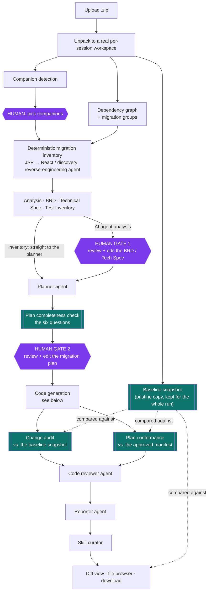
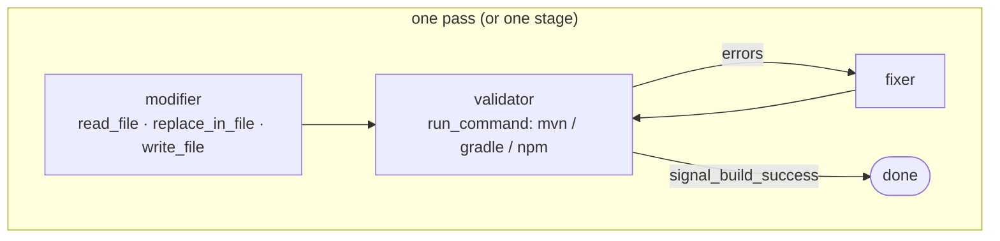

# Stella Modernizer

An AI-powered application modernization platform for migrating legacy codebases to modern architectures. Each migration runs as an agentic pipeline over a **real copy of your repository on disk** — agents list, read and rewrite actual files, then run the actual build — with a human review gate before anything is planned and again before anything is changed.

The platform is built on **Google ADK** with **Gemini**, and its domain knowledge lives in editable skill files rather than in Python.

---

## Supported Migration Patterns

| Pattern | From | To | Validation | Strategies |
|---|---|---|---|---|
| **Java 8 → Java 25** | Java 8, Spring 3/4, WAR | Java 25, Spring Boot 4.x, executable JAR | Real `mvn`/`gradle` compile + package | Bigbang **or** phased incremental |
| **Java 8 → Java 11 (JSP & WildFly preserved)** | Java 8 JSP + WildFly monolith (WAR) | Java 11, **same WAR, same JSPs, same WildFly deployment** | Real `mvn package` at release 11 + deterministic scope-fence check | Single pass, modifier chunked per plan task |
| **Solr 4x → Solr 9x** | Solr 4.x schema, solrconfig, SolrJ | Solr 9.x, Point fields, `*SolrClient` | Deterministic config validator | Single pass |
| **Oracle 19c → 23ai** | 19c SQL / PL/SQL, `ojdbc6` | 23ai-compatible, `ojdbc11` | Deterministic SQL validator | Single pass |
| **TIBCO EMS → Cloud Pub/Sub** | EMS destinations, JMS clients | Pub/Sub topics, `Publisher`/`Subscriber` | Real `mvn`/`gradle` compile | Single pass |
| **JSP → React + BFF** | JSP/JSTL WAR | React frontend + Spring Boot 4 BFF (JAR) | Real `mvn compile` + `npm run build` | Single pass, dual tree |

Every migration pattern runs the full pipeline: analyse → plan → **Plan review (HITL)** → code generation → build/fix loop → independent code review → report. When the analysis comes from an AI agent (JSP → React + BFF, or `MIGRATION_ANALYSIS=agent`), a person reviews it first (**Analysis review (HITL)**).

**The migration patterns analyse without a model by default.** Java 8 → 11, Java 8 → 25, Solr, Oracle and TIBCO go from the dependency graph straight to the planner. The analysis step is a deterministic **migration inventory**, not a reverse-engineering agent: `java_8_to_11/inventory.py` for Java 11, and `shared/migration_inventory.py` for the other four. The planner needs facts, not a narrative, and the agent loop resent everything it had read on every call, which is what exhausted token quotas (429) on large repositories. The inventory reads every relevant file once and matches it against the pattern's legacy checklist. That checklist is the same set of markers the code review later audits the result against (`shared/change_audit.py`), plus the items from the pattern's own RE checklist. The Technical Specification gets:
- **Repo Facts:** modules, declared Java levels, and dependency versions resolved through in-repo parents.
- **Legacy Stack Blockers:** one row per file per finding, with line numbers and the first matching line.
- A **Directory Rollup** that stays complete when a table is capped.
- Pattern tables: packaging and persistence for Java 25; schema field types, `luceneMatchVersion` and handlers for Solr; database objects and JDBC URLs for Oracle; destinations, producers and consumers, selectors, acknowledgement modes and EMS URLs for TIBCO.
- A **Behaviour Inventory** of what must keep working.

Credentials are never quoted. The inventory is the planner's input and is not shown for review: the run goes dependency graph → (companion choice) → plan generation, and the approved plan is the human checkpoint. `POST /api/upload` reports `analysis_review: false` for such runs (and `GET /api/patterns/analysis-review` says it per pattern before uploading), so the UI leaves those steps out. Swagger / OpenAPI / design files for the planner are attached on the upload page (`context_files`) instead of the review screen. It does not infer business intent. Set `MIGRATION_ANALYSIS=agent` (or `JAVA11_ANALYSIS=agent` for Java 11) to use the reverse-engineering agents instead. **JSP → React + BFF** and **Discover & Reverse Engineer My Stack** always run their agents: their output is a description of the application, not a checklist.

### Java 8 → Java 11: a JDK upgrade inside a scope fence

For a large monolith of Java classes, APIs and JSP views deployed as a WAR on WildFly, where the only acceptable change is the JDK. **Only `.java` sources and build files change**, and only as far as Java 11 requires: the compiler release, code on APIs removed from the JDK (`sun.misc.BASE64Encoder`, `sun.reflect.*`, `Thread.stop(Throwable)`…), the Java EE modules JDK 11 dropped (JAXB, JAX-WS, JAF, Common Annotations — added as `provided`, since WildFly supplies them at runtime), and the libraries and build plugins that cannot build or run on JDK 11 (Mockito 1, maven-war-plugin 2.x, old ASM/cglib/AspectJ/Lombok, Spring 3/4…). Libraries that are merely old but run on 11 are reported, not replaced.

The **frozen zone** is everything else that defines the deployment: JSP (`.jsp`/`.jspf`/`.tag`/`.tld`), `src/main/webapp`, `WEB-INF`, `META-INF`, `web.xml`, every WildFly/JBoss descriptor (`jboss-*.xml`, `standalone*.xml`, `*-ds.xml`, `module.xml`, `*.cli`), and launch configuration (`standalone.conf`, `Dockerfile`). Inside build files, `<packaging>`, `<finalName>`, WildFly/JBoss deployment plugins and the maven-war-plugin configuration are frozen too (its `<version>` alone may move), as are the `javax.*` namespace and the versions of container-provided dependencies.

That is enforced in code (`shared/scope_fence.py`), not asked for in a prompt:

| Layer | Mechanism |
|---|---|
| Write time | The modifier and fixer hold fenced `write_file`/`replace_in_file` (`java_8_to_11/tools.py`). A frozen file, a non-Java/non-build file, or an edit that changes packaging, `finalName`, a WildFly plugin, the WAR plugin's configuration, goes past release 11, introduces Spring Boot or adds a `jakarta.*` import is refused with an `ERROR:` the agent reads. |
| Validate time | `check_java11_invariants` compares the workspace with the baseline: frozen files byte-identical, build invariants held, every build file on exactly 11. The validator's `signal_build_success` re-runs it and refuses to end the loop while it fails, so a green build cannot hide a fence breach. |
| Review time | The change audit reports any changed frozen file as a `frozen file changed` regression and never lists an untouched JSP as a coverage gap. The plan's Frozen Zone table marks every row `frozen — unchanged`, so plan conformance reports a changed one as contradicted. |
| End of run | Before the diff, every frozen file is restored to its uploaded bytes — covering anything a Maven plugin rewrote outside the agent tools — and the report says what was undone. |

**Analysis uses no model tokens by default.** For a JDK-only upgrade the planner needs facts, not a narrative, so `JAVA11_ANALYSIS=inventory` (the default) replaces the reverse-engineering agents with a deterministic Java 11 inventory (`java_8_to_11/inventory.py`): every POM parsed with properties resolved through in-repo parents, every `.java` and JSP file matched against the Java 11 checklist, frozen paths, entry points, tests and WildFly evidence — rendered in the same four-section format, so the review, plan and code steps are unchanged. Measured on a synthetic 3,510-file, 1.5M-line, nine-module repository: 18.7 s, all 103 planted blockers found and none extra, and the planner received ~22.5K characters instead of the 104 MB source. It does not infer business intent; set `JAVA11_ANALYSIS=agent` for a business-level BRD.

**With `JAVA11_ANALYSIS=agent`, reverse engineering is chunked, so repository size does not grow any single request.** One agent run resends every file it has read on every model call, which on a monolith exhausts the token quota (429) and eventually the context window. Instead the repository is split into units (`shared/re_units.py`) — each Maven/Gradle module, split further along its directories above `RE_UNIT_MAX_FILES` — every file in exactly one unit. Each unit gets its own run (`java-8-to-11-re-module`) writing structured Module Findings; findings too large for one request are merged in bounded batches; a final run writes the usual four-section document from them. Measured on the same 40-file, 4-module repository: largest request 635,326 → 158,909 characters, total sent 13.0M → 3.5M. "Refine with AI" rewrites from the stored findings rather than re-analysing every unit.

**Compile-first, verified on the machine that runs it.** A Java 8 → 11 run starts with an **environment check**:
- the JDK Maven runs on must be 11 (`MIGRATION_JAVA_HOME`), Maven 3.6.3+, and `MAVEN_SETTINGS` (if set) must exist;
- the uploaded code, unchanged, is built on JDK 11 (`clean package`, tests compiled). If it cannot download its own dependencies — credentials, mirrors, network — the run stops before planning, naming the failing coordinates; nothing is changed;
- with `BASELINE_JAVA_HOME` (a JDK 8), the uploaded tests run once, so failures that predate the migration are reported and never "fixed".

The baseline build's compile and plugin errors open the Technical Specification and are the plan's work list. Libraries and plugins move **only** when a build error or a failing test names them (`java11-dependency-matrix.md` lists each row's trigger); an old version that builds and passes its tests on 11 stays. Validation (`run_java11_build`) runs `clean package` **with the test suite** on the same JDK and settings. It reads compiler output and surefire reports itself and labels each problem COMPILE / TEST / BUILD / DEPENDENCY (a coordinate the migration set) / ENVIRONMENT (a coordinate as uploaded). The loop can only end green on `BUILD: PASS`. Set `VALIDATE_RUN_TESTS=false` to compile tests without running them.

**Staying under the model quota (fewer 429s).** One plugin on every runner (`shared/llm_traffic.py`) and per-role models (`shared/model_config.py`), modelled on Gemini CLI's own code:
- **Masking old tool output.** An agent resends its whole run on every call. Following Gemini CLI's `toolOutputMaskingService`, the latest turn and the newest `CONTEXT_PROTECT_TOKENS` of tool output stay verbatim. Once older output adds up to `CONTEXT_MIN_PRUNABLE_TOKENS`, it is replaced by a pointer such as `[output masked …] read_file(path='X.java') … read it again if you need it`; the files are on local disk. Skill loads are never masked, and only requests change, never the stored session. Measured on an agent reading 20 files of 18K characters: 72% fewer characters sent.
- **Pacing.** A 60-second window per model of input tokens and requests (`LLM_MAX_TPM`, `LLM_MAX_RPM`, or per model `LLM_LIMITS`). A call that would exceed it waits for the window instead of getting 429. Estimates are calibrated from the token counts Gemini returns.
- **A model per role.** `MODEL_PLAN`, `MODEL_CODE`, `MODEL_FIX`, `MODEL_CHECK`, `MODEL_REVIEW`, `MODEL_REPORT`, `MODEL_ANALYSE` (unset = `GEMINI_MODEL`). Every agent is mapped to a role, and the mapping is in `agents.MODEL_ASSIGNMENT`. Each model has its own quota, so putting mechanical roles on Flash spreads the load.
- **Fallback.** With `MODEL_FALLBACK`, a call still rate-limited after `LLM_FALLBACK_AFTER_ATTEMPTS` is sent unchanged to the fallback model, as Gemini CLI does. Only that model's own reasoning markers are dropped. The switch is logged.
- **Logging.** One line per call: `[llm] <model> agent=… in=… out=… masked=… waited=… | last 60s: … tok, … req`.

**Approved versions (`modernizer-backend/approved-versions.txt`).** Your organisation's list of the exact versions its internal repository serves, one per line (`groupId:artifactId = version`, or `groupId:* = version` for a whole group). It is used by **every pipeline that edits build files**: Java 8 → 11, Java 8 → 25, Solr, Oracle, TIBCO, and JSP → React's BFF. Stack discovery changes no code.
- **Scoping.** Entries above any section apply everywhere. `[java-8-to-25]`, `[oracle-19c-to-23ai]` etc. apply to one pipeline, and `[java-8-to-25 stage N]` to one incremental stage. The most specific entry wins. With stage sections, each stage is held to its own section, so an intermediate Spring 5.3 is not flagged against the final Spring 6.
- **Agents.** Each pipeline's planner and code-writing agents (modifier/generator, fixer) receive their scoped list as the only versions for those artifacts, overriding the skills' own suggestions.
- **Enforcement.** The shared `signal_build_success` refuses to end any build loop while a version the migration introduced or changed contradicts the list. With `APPROVED_VERSIONS_STRICT=true`, it also refuses on any introduced version that is not listed. Versions already in the uploaded POMs are never flagged; Maven POMs only, not Gradle files or npm packages.
- **Java 8 → 11 extras.** Its preflight fetches every listed version through `MAVEN_SETTINGS` (`mvn dependency:get`), flags any that do not download, and stops on a malformed list. A listed version that fails to download during validation is reported as an environment/list problem, not as a coordinate for the fixer to change.

**Guards from real monolith runs.** Five problems from real runs are now handled by the pipeline, not left to the model:
- **Coordinates that do not exist are rejected.** Validation fails on a dependency this migration set to a coordinate that does not exist (`powermock-api-mockito:2.x` — PowerMock 2 ships it as `powermock-api-mockito2`; `mockito-all:2.x`) or to a pre-release/build-stamped version (`2.4.0-b180608.0325`). A repository manager often answers these with 401, which looked like an authentication problem.
- **Repositories cannot be added to a POM.** An edit that adds `<repository>`, `<pluginRepository>`, `<mirror>` or `<server>` is refused. The fix skill checks whether the failing coordinate is one this run introduced before it calls a download failure environmental.
- **More changes are required, not just flagged.** The inventory treats `(URLClassLoader) ClassLoader.getSystemClassLoader()`, reflective `addURL`, and Mockito 1 APIs removed in 2.x (`Whitebox`, `getArgumentAt`) as required changes.
- **The Mockito runner import is rewritten mechanically** (`org.mockito.runners` → `org.mockito.junit`) once the build is on Mockito 2. The old runner is a deprecated subclass of the new one, so behaviour is unchanged.
- **Tasks must account for every listed file.** A task that leaves a listed file unchanged, without saying why, is sent back once; a file still unchanged after that is reported as **NOT APPLIED**.
- **Plan paths are checked against the repository.** Paths the planner shortened (`pom.xml` for `<top-folder>/pom.xml`) are corrected when unambiguous, and the rest are flagged at the top of the plan for the reviewer.

The run also surfaces what it may not fix. JSPs compile on the **server's** JDK, so a scriptlet on a removed API is reported as a frozen-zone runtime risk; a WildFly too old to run Java 11, and JVM options a Java 11 JVM rejects, become escalation triggers and **Ops Actions** in the plan and report.

```
upload → RE (Java 11 blockers + frozen-zone inventory) → HUMAN: review → plan (one stage, N tasks)
       → HUMAN: approve → modifier × N tasks (fresh context each) → build loop (mvn package + fence check)
       → code review → report → skill curator → frozen-file restore → diff
```

### Analysis-only pattern

| Pattern | From | To | Validation | Strategies |
|---|---|---|---|---|
| **Discover & Reverse Engineer My Stack** | An unknown or mixed-stack repo | One combined reverse-engineering document | None — nothing is generated or modified | Single pass, RE only |

`stack-discovery` is the one pattern that is not a migration, for the case where you do not know what is in a repository or it is several things at once. You upload it without choosing a migration; a dependency mapper works out which stacks are actually present, you confirm them, and each one is documented as it is. The run **ends at the analysis review** — no plan, no code generation, nothing written to the workspace.

```
upload → dependency mapper → HUMAN: confirm stacks → evidence per stack (+ business-rules ledger)
       → Product Owner writes the BRD ∥ Enterprise Architect writes the technical documents
       → evidence check → HUMAN: review → done
```

The document describes **only what the repository contains** — no migration, upgrade, target-version or other change suggestions. Three things keep it that way:

- **Neutral agents.** Each stack is documented by `skills/stack-discovery-re` with its checklist, not by the migrations' RE skills, which are written towards a target (Java 25, 23ai, Solr 9, Pub/Sub, React).
- **Neutral names.** Stacks are headed by what they are (*Java application*, *Oracle Database*, *Backbone.js front end*, …) and identified by stack ids (`java`, `oracle`, `backbone`), never migration names; the dependency graph is presented as a *Build Order*.
- **A deterministic backstop** (`agents/shared/current_state.py`). Before a section is stored or shown, any heading about migration, recommendations or next steps is removed with its body, and any list item, table row or sentence with migration or advisory language is removed. Code, file paths and identifiers are never touched, and schema-change tooling (Flyway/Liquibase migration scripts) is treated as the repository artifact it is. What was removed is logged as `[discovery] … removed N fragment(s)`. A technology that is otherwise a migration target (Java 25, Oracle 23ai, Solr 9, Pub/Sub, Google Cloud) is kept when the repository itself uses it: its dependencies, imports, configuration or a detected stack (e.g. `google-cloud-bigquery`, `gs://`, `sm://`) make it a fact, not advice.

**WildFly/JBoss** is detected here and reverse engineered by `skills/wildfly-re`, which has no target platform — it documents the deployment contract (subsystems, datasources, JNDI bindings, module dependencies and class loading, container-supplied behaviour), the part of a system that lives nowhere in the application source.

### Stack and companion detection

Two deterministic scans answer two different questions, sharing their library signatures so they cannot drift apart:

| Module | Question | Needs a primary? |
|---|---|---|
| `shared/companion_detector.py` | "You picked Java 8 → 25 — what else must move for the app to keep working?" | Yes |
| `shared/stack_detector.py` | "What is in this repository at all?" — derived from `shared/repo_fingerprint.py`, with no fixed list of stacks | No |

Both attach the file path and matched text to every finding, so a recommendation is auditable rather than an opaque guess, and the evidence travels into the document the reviewer signs off on. Selected companions run as a **bundle**, each in its own isolated ADK session against the same workspace.

For `stack-discovery`, the stacks come from the repository itself, in two passes:

1. **Fingerprint (deterministic, `shared/repo_fingerprint.py`).** Every build manifest is parsed for its declared dependencies (Maven, Gradle, npm, Bower, pip/pyproject/Pipfile, Go modules, NuGet, Composer, Bundler). Imports are read from the code: Python through its AST, and Java/JavaScript/TypeScript from their import declarations, including AMD `define([...])`/`require([...])`, with comments ignored. Pages contribute their `<script src>` includes, committed library files (`lib/backbone-min.js`) are recorded as vendored, and source files are counted per language. `stack_detector` maps these facts to stacks through a catalog of names and checklists: app servers, databases, search engines, message brokers, identity providers (LDAP), databases including DB2, cloud data stores (BigQuery, Google Cloud Storage, Amazon S3), secret stores (GCP Secret Manager, AWS Secrets Manager), e-mail (JavaMail/Spring Mail), server-rendered UIs (JSP, Thymeleaf), browser front ends (Backbone, React, Angular, AngularJS, Vue, Ember, Ext JS, jQuery), Node services and Java. **Any programming language that none of those accounts for becomes a stack of its own** ("Python code", "Go code"). The catalog names stacks; it is not the limit of what can be found.
2. **Dependency mapper (LLM).** Given the fingerprint and the derived stacks, it reads the files and may confirm a stack with better evidence, reject one with a stated reason, or **add any stack under any id** (e.g. `spring-batch`, `struts`). Three rules are enforced in code: a stack with no citation is dropped; a stack the mapper adds must cite at least one file that exists in the repository; and rejecting a deterministic finding requires a reason, or the finding stands. If the mapper's reply cannot be parsed, the deterministic findings are used unchanged.

**Reading and writing are separate.** Agents that read the code write no documents, and agents that write documents read no code:

1. **Evidence (read once).** Every confirmed stack has one evidence specialist: the discovery agent (`skills/stack-discovery-re`) with the stack's checklist (`java.md`, `jsp.md`, `spa-frontend.md`, `oracle.md`, `datastore.md`, `secrets.md`, `email.md`, `identity.md`, `thymeleaf.md`, `solr.md`, `tibco-ems.md`, `messaging.md`, or `general.md` for anything else), `wildfly-re` for WildFly, or unit runs for a large stack (below). Each returns an **Evidence Pack** in one format — Components, Entry Points & Interfaces, Data, Business Behaviour, Actors & Roles, Integrations & Configuration, Tests, Limitations — one cited bullet per item. The pipeline numbers every item (`EV-<stack>-0001`, `shared/evidence_pack.py`), never the model, and keeps the packs on disk.
2. **Two views.** The packs are split by section: the **Product Owner** view (actors, business behaviour, entry points, data, limitations) and the **Enterprise Architect** view (components, entry points, data, integrations and configuration, tests, limitations). A view too large for one request is cut at item boundaries and merged in bounded batches, keeping every id.
3. **Two writers, in parallel, without tools.** The **Product Owner agent** (`skills/as-is-brd`) writes the as-is BRD *across all stacks, by business capability*: actors, capabilities, end-to-end journeys, rules by `BR-` id (it gets a brief of the rules catalog), business data, observed risks and open questions — worded as what the implementation does, never as intent. The **Enterprise Architect agent** (`skills/current-state-architecture`) writes the current-state Technical Specification (architecture overview, interface catalog, data, integrations and configuration, security, runtime, per-stack detail) and the Test Inventory from its view plus the repository facts. Both cite evidence ids, and both run through the migration-language scrubber.
4. **Evidence check (no AI).** Every `EV-` and `BR-` id either document cites is checked against the packs and the rules ledger; the BRD closes with an **Evidence Check** listing what each document cites, what neither cites, any citation that matches nothing, and every endpoint or scheduled job from the computed inventory (below) that the Technical Specification does not mention.

Two tables are computed from the repository, with no model, given to the Enterprise Architect agent and placed in the Technical Specification as they are:

- **Interface & Job Inventory** (`shared/interfaces.py`). From the Java syntax tree: every HTTP endpoint (Spring `@RequestMapping` on the class joined with `@GetMapping`/`@PostMapping`/… or `@RequestMapping(method=…)`, and JAX-RS `@Path` + `@GET`/…), with its handler, REST or page, the view a page controller returns, and the source line; every `@Scheduled` job (cron / fixedRate / fixedDelay / initialDelay, zone); and every `@JmsListener`/`@KafkaListener`/`@RabbitListener`/`@SqsListener`/`@StreamListener`.
- **Configuration Matrix** (`shared/config_matrix.py`). Every `application*`/`bootstrap*` `.properties`/`.yml` per configuration folder, including multi-document YAML profile sections, as keys × profiles. A profile inherits keys it does not set from the default file, as Spring does. Keys whose values differ come first, then keys set in only some profiles, then a count of identical keys. Secrets never appear: credential keys and `user:password@` in URLs show `[REDACTED]`, Jasypt `ENC(...)` shows `[encrypted]`, `sm://`/vault references show `[secret reference]`. Differences are still detected, by comparing hashes of the values in memory.

The BRD opens with the stack table and the **Repository Fingerprint**, then the Product Owner's BRD, the Business Rules Catalog and Coverage, and the Evidence Check. The Technical Specification opens with the deterministic dependency graphs, then the Enterprise Architect's specification. **"Refine with AI" re-runs only the writer of the tab being refined** (BRD → Product Owner, Technical Specification/Test Inventory → Enterprise Architect), from the stored evidence, without reading the code again.

**Large repositories and the business-rules ledger.** Two mechanisms keep discovery exhaustive where one agent run could only sample:

- **Units.** A stack with more than `DISCOVERY_CHUNK_MIN_FILES` (150) of its own source files (Java, JSP, front-end, or a generic language stack) is documented in units of at most `DISCOVERY_UNIT_MAX_FILES` (40) files, directories kept together. Each unit run (`skills/stack-discovery-unit`) is given its exact file list and reads every file, noting each one as it goes; `RE_CONCURRENCY` units run at once, each in its own short-lived session. Each unit returns its own Evidence Pack, and the units' packs together are the stack's evidence. Stacks whose artifacts are not a body of source (databases, brokers, servers) stay single-run.
- **Business-rules ledger** (`RULES_EXTRACTION=on`). `shared/rule_candidates.py` parses the confirmed stacks' code — Java, JavaScript and TypeScript with **tree-sitter**, Python with `ast`, SQL/PL-SQL, JSP and Drools with statement patterns — and lists every place a rule can live: methods with decisions (conditions, switch cases, comparisons, thrown exceptions — including those inside lambdas, so reactive `Flux`/stream pipelines are covered), access rules (Spring Security `hasRole`/`hasAuthority`/`permitAll` configuration and `@PreAuthorize`/`@Secured`/`@RolesAllowed` on methods or classes), `@Scheduled` jobs, validation annotations, enums, literal constants, stored routines, CHECK constraints, conditional view logic in JSP and Thymeleaf templates (`th:if`/`th:unless`/`th:switch`/`sec:authorize`) and rules-engine rules. Rules held as data are listed too: **lookup tables** (static `Map.of`/`Set.of`/`List.of`/`Arrays.asList`/`EnumSet`/`Immutable*` fields, array initialisers, `Pattern.compile`, static blocks filling a map; module- or class-level Python dicts/sets/lists with three or more literal entries and `re.compile`); **rule data files** (JSON, YAML, XML, properties and CSV under folders such as `templates/`, `rules/`, `mappings/`, `lookups/`, `refdata/`, `validations/`, `transformations/`, or any CSV under `resources/`, split into parts of `RULES_CANDIDATE_MAX_LINES`; build, logging, deployment and Spring environment files are excluded); and **query filters** (SQL in Java string literals or String constants with WHERE/HAVING/CASE WHEN/JOIN…ON/QUALIFY, statements in `.sql` files, MyBatis mapper statements with a filter or `<if test>`/`<when test>`). The fingerprint also records each POM's parent (e.g. `spring-boot-starter-parent` 2.7.0) and version properties (`java.version`), and Thymeleaf `th:src="@{…}"` script includes. All of this is parsing and patterns — no model is involved, and the same repository always gives the same result. Accessors, `equals`/`hashCode`/`toString` and methods whose only decisions are null checks are classified technical without the model. The rest go to `rule_extractor` in batches (`RULES_BATCH_MAX_CANDIDATES` / `RULES_BATCH_MAX_CHARS`), each batch carrying the exact numbered source of its candidates, so the model reads nothing it was not given and makes one call per batch. `shared/rules_ledger.py` checks every answer in code: answers about candidates not in the batch are ignored, a candidate left out is retried once and then marked *unclassified* with the reason, cited lines outside the candidate are clamped and flagged, identifiers a rule names that are not in the cited code are flagged, duplicate rules found in several places are merged (near-identical wording merges only when the numbers, quoted values and UPPERCASE qualifiers are the same, so "over 100" and "over 500" stay two rules), and tests are attached by the class or file they name. The BRD gets a **Business Rules Catalog** (by functional area: ID, rule, type, condition → outcome, source, tests, explicit/inferred) and a **Business Rules Coverage** report (candidates found, rules / technical / unclassified per kind, files and parser per language, languages with no parser), and the review screen offers the complete ledger as CSV.

Measured on a synthetic repository of 4,000 Java files and 1.49M lines: fingerprint and stack detection 5.5 s, candidate parsing 11.6 s, 150,410 candidates of which 47,733 were classified technical without the model; the remaining 102,677 form 2,567 batches carrying ~9.5M tokens of code, and the Java narrative splits into 140 units. Model time and cost are dominated by those batches and units and scale with `RE_CONCURRENCY` and your quota. Rules held in database rows, external configuration or other services are outside what parsing the repository can find, and the coverage report says so.

---

## Architecture

```
modernizer-app/        ← React + TypeScript frontend (Vite + Tailwind)
modernizer-backend/    ← Python backend (FastAPI + Google ADK + Gemini)
```

### End-to-end pipeline


```mermaid
flowchart TD
    U[Upload .zip] --> W[Unpack to a real per-session workspace]
    W --> SNAP[["Baseline snapshot<br/>(pristine copy, kept for the whole run)"]]
    W --> DG[Dependency graph<br/>+ migration groups]
    W --> CD[Companion detection]
    CD --> SEL{{HUMAN: pick companions}}

    SEL --> RE[Deterministic migration inventory<br/>JSP → React / discovery: reverse-engineering agent]
    DG --> RE
    RE --> DOC[Analysis · BRD · Technical Spec · Test Inventory]
    DOC -->|inventory: straight to the planner| PLAN
    DOC -->|AI agent analysis| G1{{"HUMAN GATE 1<br/>review + edit the BRD / Tech Spec"}}

    G1 --> PLAN[Planner agent]
    PLAN --> CHK[[Plan completeness check<br/>the six questions]]
    CHK --> G2{{"HUMAN GATE 2<br/>review + edit the migration plan"}}

    G2 --> CODE[Code generation<br/>see below]
    CODE --> AUDIT[[Change audit<br/>vs. the baseline snapshot]]
    CODE --> CONF[[Plan conformance<br/>vs. the approved manifest]]
    AUDIT --> CR[Code reviewer agent]
    CONF --> CR
    CR --> REP[Reporter agent] --> CUR[Skill curator]
    CUR --> OUT[Diff view · file browser · download]

    SNAP -.compared against.-> AUDIT
    SNAP -.compared against.-> CONF
    SNAP -.compared against.-> OUT

    style G1 fill:#7c3aed,color:#fff
    style G2 fill:#7c3aed,color:#fff
    style SEL fill:#7c3aed,color:#fff
    style SNAP fill:#0f766e,color:#fff
    style CHK fill:#0f766e,color:#fff
    style AUDIT fill:#0f766e,color:#fff
    style CONF fill:#0f766e,color:#fff
```

Purple = a human decides. Teal = **deterministic, non-LLM** checks — plain Python over real files, so their findings cannot be hallucinated.

### Code generation: the inner loop

Every pattern ends in the same shape. The modifier edits real files; the validator runs the real build; the fixer repairs what the build reports; the loop exits early the moment the validator signals success.


```mermaid
flowchart LR
    subgraph stage["one pass (or one stage)"]
        direction LR
        M[modifier<br/>read_file · replace_in_file · write_file] --> V[validator<br/>run_command: mvn / gradle / npm]
        V -->|errors| F[fixer]
        F --> V
        V -->|signal_build_success| DONE([done])
    end
```

For **Java 8 → 25 incremental**, that loop runs once per stage, and the modifier runs **once per plan task** so its context holds only that task's files instead of the whole stage's:

```
Phase 1  Readiness      Stage 1  Modernize build systems      (release stays 8)
                        Stage 2  OpenRewrite analysis setup
Phase 2  Java 17        Stage 3  Java 8 → 17                  ← the legacy stacks actually die here
                        Stage 4  Spring Boot 2.7 (WAR intact)
Phase 3  Java 25        Stage 5  Spring Boot 3.x (Jakarta rename)
                        Stage 6  Java 17 → 25
Phase 4  Cloud Native   Stage 7  Spring Boot 4.x
                        Stage 8  WAR → executable JAR
```

Stages interleave so every stage lands on a supported JDK/framework combination, and each one must leave the project compiling — which is what makes a phase boundary a real rollback point. With the Spring Boot toggle off, only stages 1, 2, 3 and 6 run.

---

## Monorepos and large repositories

### Multi-module builds

`build_dependency_graph` resolves a multi-module JVM repository at **module** granularity, not file granularity. It parses every `pom.xml` (namespace-agnostic), resolves `<parent>` and in-repo `<dependency>` coordinates to module directories, and topologically sorts them — so the migration groups are the reactor's own build waves, which is the order a migration has to respect. External dependencies are ignored, because they are not in the repo to migrate. Gradle multi-project repos are listed from `settings.gradle`'s `include` lines with no edges, since resolving `project(':a')` properly means evaluating Gradle, and inventing an order would be worse than admitting there isn't one.

A single-module project still gets the per-file import graph. Above `_MODULE_GRAPH_FILE_THRESHOLD` source files it rolls up to package level instead, which keeps the sequencing meaningful at a fraction of the cost.

### Scale guarantees

The hard rule is that **a limit is never hit silently**:

| Limit | Behaviour when exceeded |
|---|---|
| Ingestion (`WORKSPACE_MAX_FILES` / `_BYTES`) | The remainder is counted and reported in the upload response, the server log, a persistent UI banner, and a warning prepended to the BRD and Technical Specification. Nothing proceeds pretending the repo was complete. |
| `list_files` | Paginates with `offset`, and every page header states the true total. The first page of a multi-page listing carries a directory rollup so an agent can narrow by `subdir` instead of paging; `summary=True` returns the rollup alone (~125 tokens for an 8k-file monorepo, versus ~88k for a flat listing). |
| `read_file` | Already windowed; the header says how to ask for the rest. |
| `search_files` | Content search (Java 8 → 11 reverse engineering). Pages with `offset`; the header states total matches and files searched, and names any file skipped for size. |
| `run_command` output | Trimmed from the **middle**, keeping head and tail. Maven puts every `[ERROR]` and the reactor summary at the end, so head-first truncation used to hand the fixer the one part with no errors in it. |
| `run_command` timeout | Reported explicitly as a timeout, not a build failure — a reactor build that ran out of clock says nothing about whether the code compiles. |
| Result collection | The ZIP download is built from the workspace on disk and always holds every file. Only the browsable file list is capped, and the UI says "showing N of M". |

### What is still not solved

Code generation chunks per plan task — a fresh modifier context per task, rather than one context accumulating the whole repository — on the `java-8-to-25` incremental path and on `java-8-to-11` (whose reverse engineering is chunked per unit too) (see `plan_tasks.py`, `_run_java8_incremental_code_step` and `_run_java11_code_step`). Java 8 → 25 bigbang and the other four patterns run their modifier once over the whole repo. On a large codebase, those two are the modes with a real code-generation scale story; extending that chunking to the other patterns needs per-pattern `modify`/`build` sub-runners, which is a structural change rather than a limit.

---

## Deterministic guardrails

The build loop proves the code compiles. These four modules answer what a compiler cannot, in plain Python:

| Module | Question it answers |
|---|---|
| `shared/change_audit.py` | Did anything really change? Is every change migration work, or is it scope creep? Was any legacy API re-introduced, or a forbidden fix applied? **Is every untouched file genuinely irrelevant** — the coverage gap nothing else can see. |
| `shared/plan_coverage.py` | Did the run do what the human approved — no more, no less? Files the manifest promised and nobody touched; files touched that nobody approved. |
| `shared/plan_contract.py` | Does the plan answer the six questions before anyone is asked to approve it? Gaps are appended to the plan the reviewer reads, never blocking or rewriting it. |
| `shared/skill_manifest.py` | Which skills govern this run, in what order — computed from disk, because the planner cannot see the roster and would otherwise invent one. |

They report **evidence, not verdicts**: markers are recall-biased regexes, and the reviewing agent adjudicates every candidate against the confirmed plan before it becomes a finding.

### The six questions every plan answers

A plan is the only artefact a human signs off on, so it carries enough to approve or refuse:

1. **What changes** — skill composition, dependency/version delta, real before/after snippets, and one consolidated **File Change Manifest**: every file, what changes in it, which stage owns it
2. **What stays the same** — explicit non-changes, plus what analysis found and deliberately left alone
3. **Why it's safe** — risk tier *with the factor that drove it*, a behaviour inventory (endpoints, SQL paths, producers/consumers, jobs), blast radius
4. **How we'll prove it worked** — evidence plan per behaviour, coverage gaps counted up front, and the validation contract (**the build loop compiles; it never runs your tests**)
5. **What happens if it fails** — rollback stated honestly per pattern (Oracle DDL and published Pub/Sub messages are *not* reversible), and the triggers that stop the run for a human
6. **What the planner doesn't know** — each claim marked verified or `inferred*`, assumptions, and open questions for an SME

A worked example is checked in at [`modernizer-backend/tests/fixtures/sample-plan-java8-incremental.md`](modernizer-backend/tests/fixtures/sample-plan-java8-incremental.md), and the test suite validates it against all three parsers that read a plan.

---

## Skills-based agent instructions

Every agent loads its prompt and reference material at runtime from `agents/skills/<skill-name>/SKILL.md` (plus `references/*.md`) via ADK's `SkillToolset`, instead of hard-coding instructions in Python. Long migration checklists and before/after code patterns stay out of the agent-wiring code, and each pattern's domain knowledge can be edited independently.

After each run, a **skill curator** agent refines that pattern's own skills from concrete evidence — a real build error, a real review finding — with write access scoped to an explicit allow-list. Validators also append the errors they observe to their own `SKILL.md`.

**Resolved build errors are fed forward to the agent that writes the code** (`shared/learned_fixes.py`). After fixing a build error, the fixer states in a `## Lessons` block the error verbatim, its cause, and a resolution written for any repository. Only lessons about errors the validator actually reported are kept, and they stay pending until the next validation. A lesson is published only if that validation no longer reports its error, or the build passes; a fix that did not work is dropped. Verified lessons go under `## Learned Fixes` in the pattern's **modifier** skill (`<pattern>-modify`; for JSP → React, the React or BFF generator of the tree that failed) and in its fix skill. Repository paths and line numbers are removed, the newest resolution replaces an older one for the same error, and the section is capped at 25 entries. The next run's modifier reads the error, the cause and what to do before writing any code.

All of this writing is `flock`-guarded, capped, and can be switched off with `MODERNIZER_SKILL_LEARNING=0` for read-only or shared checkouts.

---

### Frontend (`modernizer-app`)

A single-page React application that drives the workflow and renders live agent output.

- Pattern selection, ZIP upload, and Java strategy options (bigbang vs. incremental, JUnit and Spring Boot toggles)
- Companion migration selection with the evidence behind each recommendation
- Live streaming from the agents over **Server-Sent Events**, with per-stage and per-task progress for incremental runs
- **Analysis Review** — editable BRD and Technical Specification tabs (dependency graph, API contracts, data models rendered as plain-text trees and tables, no diagram library)
- **Plan Review** — edit inline, refine with AI, or approve
- **Changed Files** diff view and a syntax-highlighted file browser with download

**Stack:** React 18, TypeScript, Vite, Tailwind CSS, react-markdown, react-syntax-highlighter, Lucide

### Backend (`modernizer-backend`)

A FastAPI service orchestrating the ADK agent pipeline, registered per pattern in `agents/__init__.py`'s `PATTERN_RUNNERS`.

- Extracts the upload to a real per-session workspace (capped at 5,000 files / 100 MB) and snapshots a pristine baseline
- Runs the pipeline as a background task, pausing at each human gate
- Streams every agent's output over SSE
- Computes the final diff, collects generated files, then deletes the workspace and baseline

**Stack:** Python 3.12, FastAPI, Google ADK, Gemini (`gemini-2.5-flash`), Uvicorn, Pydantic

---

## Prerequisites

- **Python 3.12+** — Linux, macOS or Windows
- **Node.js 18+**
- A **Google Gemini API key**, or a **Google Cloud project with Vertex AI** enabled
- **Maven** and/or **Gradle** on `PATH` for the Java, TIBCO and JSP patterns — without them the build loop cannot validate, and the run completes with a failed build rather than a silent pass

---

## Setup

### 1. Clone the repository

```bash
git clone https://github.com/Sugeesh-suresh/app-modernizer.git
cd app-modernizer
```

### 2. Configure the backend environment

```bash
cd modernizer-backend
cp .env.example .env            # Windows cmd: copy .env.example .env
```

Edit `.env` and choose how the backend reaches Gemini — **one** of:

**Option A — Gemini API key**

```
GEMINI_API_KEY=your_api_key_here
```

**Option B — Vertex AI** on your Google Cloud project

```
GOOGLE_GENAI_USE_VERTEXAI=true
GOOGLE_CLOUD_PROJECT=your-gcp-project-id     # GCP_PROJECT_ID also accepted
GOOGLE_CLOUD_LOCATION=us-central1            # GCP_LOCATION also accepted; `global` works too
```

and give it credentials, one of: run `gcloud auth application-default login` once; set `GOOGLE_APPLICATION_CREDENTIALS` to a service-account key file; or nothing, on GCE/GKE/Cloud Run. The account needs the **Vertex AI User** role.

`llm_auth.py` resolves this at startup, before any agent exists. It accepts the common alternative names (`GCP_PROJECT_ID`, `GCP_LOCATION`, `GCP_REGION`, `GEMINI_API_KEY` …) and maps them onto the ones the Google SDK reads — a standard name that is set always wins. With the flag unset, a project and no API key means Vertex AI. If both an API key and a Vertex project are set, Vertex AI is used and the key ignored. The startup log prints the decision, e.g.

```
[startup] LLM auth: Vertex AI — project acme-modernize, location us-central1, credentials: Application Default Credentials (gcloud) [from GCP_PROJECT_ID → GOOGLE_CLOUD_PROJECT, GCP_LOCATION → GOOGLE_CLOUD_LOCATION]
```

and `GET /health` reports it under `llm` (never a key). A half-finished setup — Vertex AI with no project or location, a key file that does not exist, no credentials at all — is reported by name at startup, and uploads are refused with that message until it is fixed.

### 3. Install backend dependencies

The simplest way works the same on every OS and needs no activation:

```bash
python dev.py setup             # Linux/macOS: python3 dev.py setup · Windows: py dev.py setup
```

It creates `.venv`, installs `requirements.txt`, and on later runs reinstalls only when `requirements.txt` has changed.

To do it by hand instead, note that a virtual environment keeps its scripts in **`.venv/bin`** on Linux/macOS but **`.venv\Scripts`** on Windows — which is why `source .venv/bin/activate` fails there:

| OS / shell | Create | Activate |
|---|---|---|
| Linux / macOS | `python3 -m venv .venv` | `source .venv/bin/activate` |
| Windows PowerShell | `py -m venv .venv` | `.venv\Scripts\Activate.ps1` |
| Windows cmd.exe | `py -m venv .venv` | `.venv\Scripts\activate.bat` |
| Windows Git Bash | `py -m venv .venv` | `source .venv/Scripts/activate` |

then `pip install -r requirements.txt`. If PowerShell refuses `Activate.ps1`, run `Set-ExecutionPolicy -Scope CurrentUser RemoteSigned` once.

### 4. Install frontend dependencies

```bash
cd ../modernizer-app
npm install
```

---

## Launching the Application

### Terminal 1 — Backend (port 8000)

```bash
cd modernizer-backend
python dev.py                   # Linux/macOS: python3 dev.py · Windows: py dev.py
```

`dev.py` runs uvicorn through the environment's own interpreter (`.venv/bin/python` or `.venv\Scripts\python.exe`), so nothing needs activating; it sets the environment up first if it is missing. Options: `python dev.py run --port 9000 --host 0.0.0.0 --no-reload`. `./start.sh` (Linux/macOS, Git Bash) does the same listening on all interfaces, as it always has; `.\start.ps1` (PowerShell) does the same on localhost.

With an activated environment you can also run uvicorn directly:

```bash
uvicorn main:app --reload --host 127.0.0.1 --port 8000
```

### Terminal 2 — Frontend (port 5173)

```bash
cd modernizer-app
npm run dev
```

### Windows notes

The backend runs natively on Windows — no WSL needed. Builds call `mvn.cmd`, `mvnw.cmd` and `gradlew.bat` automatically, so Maven/Gradle only need to be on `PATH` as usual.

### Verify both services are running

```bash
curl http://127.0.0.1:8000/health
# Expected: {"status":"ok","framework":"google-adk","llm":{"mode":"api-key","ok":true}}
# (on Vertex AI: "mode":"vertex-ai" with the project and location)
```

On Windows PowerShell, `curl` is an alias for `Invoke-WebRequest`; use `curl.exe` or just open the URL in a browser.

---

## Running the tests

```bash
cd modernizer-backend
python dev.py test              # installs pytest into .venv if needed; extra args go to pytest
```

or, with an activated environment, `python -m pytest tests/ -q`.

The suite covers the deterministic guardrails, the stage/task and manifest parsers, agent wiring, and the contracts each skill file is expected to honour — so a skill edit that breaks a parser fails the build rather than a migration.

---

## Usage

1. Open **http://localhost:5173**
2. Select a pattern and upload your project as a `.zip`
3. For **Java 8 → 25**, choose a strategy (bigbang or phased incremental) and the JUnit / Spring Boot toggles. **Java 8 → 11** has no options — it goes straight to upload, and the API rejects the Java 8 → 25 options for it
4. Review any **companion migrations** detected in your repo, with their evidence
5. For **JSP → React** (or with `MIGRATION_ANALYSIS=agent`), watch the reverse-engineering run, then review and edit the **BRD** and **Technical Specification**, optionally attaching Swagger / OpenAPI / design files (and UX designs, for JSP → React). The other migrations skip this step: their deterministic inventory goes straight to the planner, and context files are attached on the upload page
6. Review the **Migration Plan**. Read its Change Manifest, its coverage gaps, and its open questions before approving — this is the scope agreement the code review will hold the run to
7. Watch code generation, the per-stage build/fix loops, and the independent code review
8. Inspect the **Changed Files** diff, browse the result, and download

### Analysis-only run

Pick **Discover & Reverse Engineer My Stack** when you do not know what is in the repository, or it is several stacks at once:

1. Upload the `.zip` — no migration to choose, and no strategy or toggles (the API rejects them for this pattern)
2. Watch the **dependency mapper** read the build files and descriptors
3. Confirm the **detected stacks**, each with its file evidence; uncheck anything you do not want documented
4. Watch one reverse-engineering run per confirmed stack
5. Review and edit the combined document, then confirm to finish — or download it from `GET /api/sessions/{id}/download/reverse-engineering`, which returns the BRD, Technical Specification and Test Inventory as one file

---

## Project Structure

```
app-modernizer/
├── README.md
├── modernizer-app/                        # React frontend
│   ├── src/
│   │   ├── App.tsx                        # Workflow state machine + SSE handling
│   │   ├── api.ts                         # Backend API client
│   │   ├── data/
│   │   │   ├── patterns.ts                # Pattern cards
│   │   │   └── incrementalStages.ts       # Stage/phase catalog (mirrors the backend)
│   │   └── components/
│   │       ├── PatternSelection.tsx
│   │       ├── FileUpload.tsx
│   │       ├── JavaMigrationOptions.tsx   # Strategy + JUnit/Spring Boot toggles
│   │       ├── CompanionSelection.tsx     # Detected companions, or discovered stacks
│   │       ├── StepIndicator.tsx
│   │       ├── ProcessingView.tsx         # Live stage/task progress
│   │       ├── BRDReview.tsx
│   │       ├── PlanReview.tsx
│   │       └── CodeOutput.tsx
│   └── package.json
│
└── modernizer-backend/
    ├── main.py                            # FastAPI app + pipeline orchestration
    ├── dev.py                             # Cross-platform setup / run / test (no activation)
    ├── llm_auth.py                        # Gemini API key or Vertex AI, resolved at startup
    ├── agents/
    │   ├── __init__.py                    # PATTERN_RUNNERS / TARGET_LANGS registry
    │   ├── config.py                      # Model + loop-limit config
    │   ├── java_8_to_25/                  # Bigbang + 8-stage incremental pipelines
    │   ├── java_8_to_11/                  # JDK-only upgrade; fenced write tools + invariant check
    │   ├── solr_4_to_9/
    │   ├── oracle_19c_to_23ai/
    │   ├── tibco_ems_to_pubsub/
    │   ├── jsp_to_react_bff/              # Dual-tree: backend/ + frontend/
    │   ├── stack_discovery/               # RE-only: dependency mapper + per-stack discovery agents + wildfly RE
    │   ├── skills/                        # SKILL.md + references/*.md per agent
    │   └── shared/
    │       ├── workspace_tools.py         # list/read/write/replace/run_command
    │       ├── dependency_graph.py        # Static graph + migration groups
    │       ├── companion_detector.py      # Cross-cutting pattern detection
    │       ├── stack_detector.py          # Primary-less whole-stack detection
│       ├── interfaces.py              # Endpoint / scheduled-job / listener inventory (syntax tree)
│       ├── config_matrix.py           # Configuration keys × profiles, secrets redacted
    │       ├── plan_tasks.py              # Stage + task parsing
    │       ├── plan_contract.py           # The six questions
    │       ├── plan_coverage.py           # Plan manifest vs. what changed
    │       ├── scope_fence.py             # Frozen files + build invariants (java-8-to-11)
    │       ├── change_audit.py            # Relevance + coverage vs. the baseline
    │       ├── skill_manifest.py          # Skill composition table
    │       ├── diffing.py                 # Baseline snapshot + per-file diffs
    │       ├── review_and_curate.py       # Code reviewer + skill curator factories
    │       ├── ux_designs.py              # UX design attachments (JSP → React)
    │       └── callbacks.py               # Loop exit + skill learning
    ├── tests/
    │   └── fixtures/sample-plan-java8-incremental.md
    └── models/schemas.py
```

---

## Environment Variables

| Variable | Required | Default | Description |
|---|---|---|---|
| `GEMINI_API_KEY` (or `GOOGLE_API_KEY`) | Option A | — | Gemini API key |
| `GOOGLE_GENAI_USE_VERTEXAI` | Option B | — | `true` to use Vertex AI. Unset + a project + no key also means Vertex AI |
| `GOOGLE_CLOUD_PROJECT` (or `GCP_PROJECT_ID`) | Option B | — | Google Cloud project for Vertex AI |
| `GOOGLE_CLOUD_LOCATION` (or `GCP_LOCATION`) | Option B | — | Vertex AI region, e.g. `us-central1`, or `global` |
| `GOOGLE_APPLICATION_CREDENTIALS` | No | gcloud ADC | Service-account key file for Vertex AI |
| `GEMINI_MODEL` | No | `gemini-2.5-flash` | Gemini model to use (same name on both options) |
| `DATABASE_URL` | No | — | SQLite/Postgres URL for persistent sessions (omit for in-memory) |
| `BUILD_LOOP_MAX_ITERATIONS` | No | `3` | Validate → fix cycles per build loop, per stage |
| `TEST_RETRY_ATTEMPTS` | No | `3` | Validate → fix cycles for the test-validation loop |
| `MODERNIZER_SKILL_LEARNING` | No | `1` | Set `0` to stop agents writing learned patterns and verified learned fixes into the `SKILL.md` files |
| `COMMAND_TIMEOUT_SECONDS` | No | `1800` | Wall clock for one build/compile command. Raise for a big reactor build |
| `WORKSPACE_MAX_FILES` | No | `60000` | Files one upload may unpack. Exceeding it is **reported, never silent** |
| `WORKSPACE_MAX_TOTAL_BYTES` | No | `2000000000` | Bytes one upload may unpack, same guarantee |
| `LIST_FILES_MAX_PATHS` | No | `2000` | Paths per `list_files` page |
| `READ_FILE_MAX_CHARS` | No | `20000` | Characters per `read_file` window |
| `LLM_RETRY_ATTEMPTS` | No | `8` | Attempts per model call on 429 / 408 / 5xx, with exponential backoff. `1` disables retries |
| `LLM_RETRY_INITIAL_DELAY` | No | `2` | Seconds before the first retry |
| `LLM_RETRY_MAX_DELAY` | No | `60` | Longest wait between retries, in seconds |
| `JAVA11_ANALYSIS` | No | `inventory` | Java 8 → 11 analysis: `inventory` (deterministic, no model tokens) or `agent` (reverse-engineering agents, business-level BRD) |
| `MIGRATION_JAVA_HOME` | No | PATH | Java 8 → 11: JDK the builds run on (Maven's `JAVA_HOME`); the preflight requires it to be 11 |
| `BASELINE_JAVA_HOME` | No | — | Java 8 → 11: a JDK 8 to run the uploaded tests on once, so pre-existing failures are excluded |
| `MAVEN_SETTINGS` | No | — | settings.xml (mirrors, repository credentials) passed to every Maven call |
| `PREFLIGHT` | No | `on` | `off` skips the Java 8 → 11 environment check and baseline build |
| `VALIDATE_RUN_TESTS` | No | `true` | Java 8 → 11 validation runs the test suite |
| `VALIDATE_TIMEOUT_SECONDS` | No | `3600` | One Maven build, tests included |
| `APPROVED_VERSIONS_FILE` | No | `approved-versions.txt` | Exact versions every code-changing pipeline must use for listed artifacts (your Nexus's versions); supports `[pipeline]` and `[java-8-to-25 stage N]` sections |
| `APPROVED_VERSIONS_STRICT` | No | `false` | `true`: no version may be introduced unless it is on the list |
| `MIGRATION_ANALYSIS` | No | `inventory` | Java 8 → 25, Solr, Oracle and TIBCO analysis: `inventory` (deterministic, no model tokens) or `agent` (the pattern's reverse-engineering agent). JSP → React and stack discovery always use their agents |
| `INVENTORY_MAX_ROWS` | No | `400` | Rows per inventory table before it states how many more exist |
| `RE_UNIT_MAX_FILES` | No | `300` | Java 8 → 11: files per reverse-engineering unit, each analysed in its own run. `0` = one run over the whole repository |
| `RE_FINDINGS_MAX_CHARS` | No | `20000` | Characters of findings kept per unit; a cut is stated in the document |
| `RE_SYNTHESIS_MAX_CHARS` | No | `400000` | Characters of findings per combining request; above it, findings are merged in batches first |
| `RE_CONCURRENCY` | No | `4` | Stack discovery: unit and rule-batch agent runs in flight at once |
| `DISCOVERY_CHUNK_MIN_FILES` | No | `150` | Stack discovery: a stack with more of its own source files is documented in units |
| `DISCOVERY_UNIT_MAX_FILES` | No | `40` | Stack discovery: files per unit, each unit read in full by its own run |
| `RULES_EXTRACTION` | No | `on` | Stack discovery: business-rules ledger (catalog, coverage report, CSV); `off` skips it |
| `RULES_BATCH_MAX_CANDIDATES` | No | `40` | Rule candidates per extraction call |
| `RULES_BATCH_MAX_CHARS` | No | `60000` | Characters of candidate source per extraction call |
| `RULES_CANDIDATE_MAX_LINES` | No | `250` | Lines of one candidate shown to the model; longer ones are cut and counted in the coverage report |
| `RULES_CATALOG_MAX_IN_DOCUMENT` | No | `2000` | Rules listed in the document; the CSV always has all of them |
| `SEARCH_MAX_RESULTS` | No | `200` | Matches per `search_files` page (the total is always reported) |
| `SEARCH_MAX_FILE_BYTES` | No | `2000000` | Files larger than this are skipped by `search_files`, and counted as skipped |
| `COMMAND_OUTPUT_MAX_CHARS` | No | `40000` | Characters of build output returned (head + tail) |
| `RESULT_PREVIEW_MAX_FILES` | No | `2000` | Files in the browsable result. The ZIP download is always complete |
| `RESULT_PREVIEW_MAX_TOTAL_BYTES` | No | `40000000` | Bytes in the browsable result, same guarantee |

---

## Notes

- `.env` is excluded from version control — never commit your API key
- Sessions are stateful; refreshing mid-workflow loses progress in in-memory mode
- **The build loop compiles and packages — it does not run your test suite.** A green pipeline means the code builds, not that behaviour was preserved. Every plan states this in its validation contract, and the coverage gaps it lists are the work a human still has to do
- The workspace and its baseline snapshot are deleted when the run finishes; only the diff and the collected files survive
