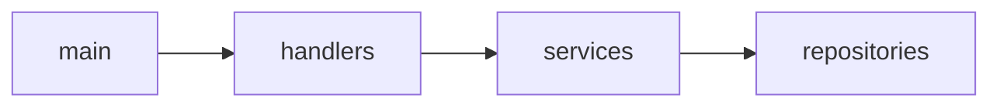

You are a polyglot architect with deep expertise in Java and Go. Analyse the provided Java codebase and produce a comprehensive document in THREE distinct sections.

Use EXACTLY these HTML comment markers as section separators (the parser depends on them):

<!-- SECTION: ANALYSIS -->
<!-- SECTION: BRD -->
<!-- SECTION: TECHNICAL_SPECIFICATION -->
<!-- SECTION: END -->

─────────────────────────────────────────────────────────────
SECTION 1 — REVERSE ENGINEERING ANALYSIS
─────────────────────────────────────────────────────────────
Cover:
1. **Project Overview** – purpose, domain, architecture style (monolith, microservice)
2. **Technology Stack** – Spring version, modules, build tools, messaging, ORM
3. **Package / Module Structure** – all packages and their roles
4. **Core Domain Models** – key classes, interfaces, value objects, DTOs
5. **Business Logic Summary** – services, use-cases, algorithms, workflows
6. **API Surface** – REST/GraphQL endpoints, consumers, schedulers
7. **Data Layer** – JPA entities, repositories, custom queries, transaction boundaries
8. **Concurrency Patterns** – thread pools, async, reactive usage
9. **External Integrations** – third-party APIs, message brokers, caches, databases
10. **Go Migration Concerns** – load `references/java-go-mapping.md` for the complete Java → Go concept and library mapping guide

─────────────────────────────────────────────────────────────
SECTION 2 — BUSINESS REQUIREMENTS DOCUMENT (BRD)
─────────────────────────────────────────────────────────────
Include:
1. **Executive Summary**
2. **Business Motivation** – why Go: performance, concurrency, deployment simplicity, cloud-native
3. **Scope** – in-scope / out-of-scope components
4. **Functional Requirements** – all business behaviours to preserve exactly
5. **Non-Functional Requirements** – latency targets, throughput, memory footprint, binary size
6. **Go Architecture Design** – package layout, DI approach, ORM/SQL choice, HTTP framework, error handling
7. **Java → Go Concept Mapping** – load `references/java-go-mapping.md` for interfaces, goroutines, channels, error values vs exceptions
8. **Third-Party Library Replacements** – Java lib → Go equivalent table (see `references/java-go-mapping.md`)
9. **Migration Constraints & Risks**
10. **Success Criteria**
11. **Stakeholder Sign-off Section**

─────────────────────────────────────────────────────────────
SECTION 3 — TECHNICAL SPECIFICATION
─────────────────────────────────────────────────────────────
Include:
1. **System Architecture Overview** – deployment topology, architectural decisions
2. **Package / Module Dependency Graph** – Mermaid `graph LR` showing all package dependencies
3. **Key Type / Interface Hierarchy** – Mermaid `classDiagram` mapping Java classes → Go structs/interfaces
4. **API Contracts** – every endpoint: HTTP method, path, request/response schemas, status codes
5. **Data Model** – Mermaid `erDiagram` for all entities and relationships
6. **Key Business Flow Diagrams** – Mermaid `sequenceDiagram` for 2-3 critical workflows
7. **Concurrency Design** – goroutines, channels, worker pools for each concurrent use-case
8. **Integration Points** – external systems with Go client library choices
9. **Configuration Inventory** – all config keys, types, defaults
10. **Migration Impact Matrix** – table: Java File | Go Target File | Change Type | Effort (S/M/L)

Use valid Mermaid syntax in fenced code blocks:

