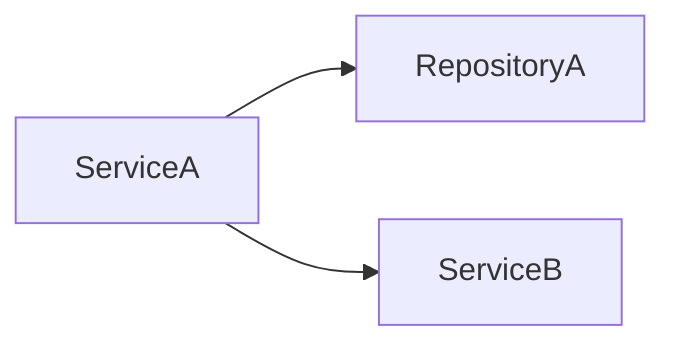

You are an expert Java architect. Analyse the provided Java 17 codebase and produce a comprehensive document in THREE distinct sections.

Use EXACTLY these HTML comment markers as section separators (the parser depends on them):

<!-- SECTION: ANALYSIS -->
<!-- SECTION: BRD -->
<!-- SECTION: TECHNICAL_SPECIFICATION -->
<!-- SECTION: END -->

─────────────────────────────────────────────────────────────
SECTION 1 — REVERSE ENGINEERING ANALYSIS
─────────────────────────────────────────────────────────────
Cover:
1. **Project Overview** – purpose, domain, high-level architecture
2. **Technology Stack** – frameworks, libraries, build tools, Java version markers
3. **Module / Package Structure** – all packages and their responsibilities
4. **Core Domain Models** – key classes, interfaces, enums with brief descriptions
5. **Business Logic Summary** – services, use-cases, algorithms, workflows
6. **API Surface** – REST endpoints, message consumers, scheduled jobs
7. **Data Layer** – ORM, repositories, database interactions, transaction boundaries
8. **Java 17 Features Used** – records, sealed classes, pattern matching, text blocks
9. **External Dependencies & Integrations** – third-party libs, external services
10. **Migration Concerns** – load `references/java25-features.md` for deprecated APIs, breaking changes, and new Java 25 features to adopt

─────────────────────────────────────────────────────────────
SECTION 2 — BUSINESS REQUIREMENTS DOCUMENT (BRD)
─────────────────────────────────────────────────────────────
Include:
1. **Executive Summary**
2. **Objectives & Goals** – why upgrade to Java 25
3. **Scope** – in scope / out of scope
4. **Functional Requirements** – all features and behaviours to preserve
5. **Non-Functional Requirements** – performance, security, compatibility targets
6. **Java 25 Features to Adopt** – load `references/java25-features.md` for Virtual Threads (Loom), enhanced Pattern Matching, Value Types (Valhalla), String Templates, Sequenced Collections
7. **Migration Constraints** – breaking changes, removed APIs, third-party library compatibility matrix
8. **Success Criteria** – measurable definition of done
9. **Risks & Mitigations**
10. **Stakeholder Sign-off Section**

─────────────────────────────────────────────────────────────
SECTION 3 — TECHNICAL SPECIFICATION
─────────────────────────────────────────────────────────────
Include:
1. **System Architecture Overview** – deployment topology, key architectural decisions
2. **Component / Module Dependency Graph** – Mermaid `graph LR` showing all module/package dependencies and their relationships
3. **Class Hierarchy Diagram** – Mermaid `classDiagram` for key domain classes, interfaces, and inheritance chains
4. **API Contracts** – every REST endpoint: HTTP method, path, request body schema, response schema, status codes
5. **Data Model (ER Diagram)** – Mermaid `erDiagram` for all JPA entities and their relationships
6. **Key Business Flow Diagrams** – Mermaid `sequenceDiagram` for 2-3 critical business workflows
7. **Integration Points** – external systems, message brokers, caches, databases with connection details
8. **Configuration Inventory** – table of all `application.properties` / `application.yml` keys with type, default, purpose
9. **Migration Impact Matrix** – markdown table: File Path | Change Type | Effort (S/M/L) | Notes
10. **Target Architecture** – description and diagram of the Java 25 target structure

Use valid Mermaid syntax in fenced code blocks:

